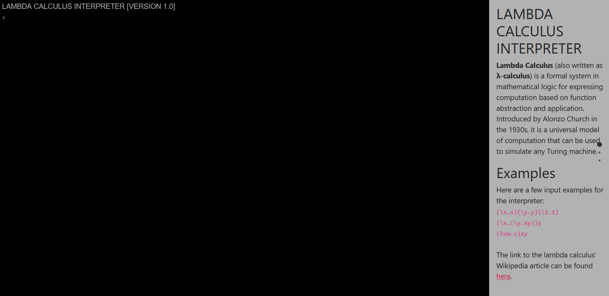

## TURING MACHINE (TM) LAMBDA CALCULUS CONVERTER

[This is a web application that hosts an interpreter for and simulates between the lambda calculus and Turing machine.](https://nunoagoncalves.github.io/Turing-Machine-Lambda-Calculus-Converter/)

The web application can either simulate from the lambda calculus to the multi-tape Turing machine or from the single-tape Turing machine to the weak lambda calculus, using the methods outlined by [Dal Lago and Martini](https://dl.acm.org/doi/10.1016/j.tcs.2008.01.044)

- Built in **HTML/CSS/JavaScript**
- User Interface built with **Bootstrap**, **JQuery**, **JQuery Terminal** and **FullPages**
- Tested using **Jest** and **Node.JS**

The lambda calculus interpreter uses an applicative-order evaluation strategy to perform beta reduction. The interpreter can reduce complicated lambda expressions, highlight the parameter and argument of a reduction, and simulate SKI combinators and boolean logic.

The TM interpter works using a JSON-based terminal as outlined by Chad Palmer in his article 'A Complete Web Page: Building a Turing Machine in JavaScript'. The TM interperter can visualise the run of the TM by simulating the movement of the machine head on the tape.

The multi-tape TM interpreter is used for simulating the lambda calculus term in a Turing machine. 

## INSTRUCTIONS FOR SIMULATING TURING MACHINE (TM) IN THE LAMBDA CALCULUS

1. In the `Single-Tape Turing Machine Interpreter`, run a TM using either an example in the drop-down list or create a TM of your own

2. In the `Lambda Calculus Interpreter`, enter 'T' to denote the beginning of the TM as a lambda term

3. In the `Lambda Calculus Interpreter`, enter to the right of 'T' the tape you want to run:

        T101

4. Run the `Lambda Calculus Interpreter`

## INSTRUCTIONS FOR SIMULATING LAMBDA CALCULUS IN THE MULTI-TAPE TURING MACHINE (TM)

1. In the `Lambda Calculus Interpreter`, enter the lambda calculus term being converted.

2. In the `Multi-Tape Turing Machine Interpreter`, the lambda calculus term previously entered should now be converted into its Dal Lago and Martini notation

3. Run the `Multi-Tape Turing Machine Interpreter`

4. The tape of the interpreter at the halting state will be the weak head normal form of the lambda calculus term in Dal Lago and Martini notation

## INTERPRETER SHOWCASE

### LAMBDA CALCULUS INTERPRETER

 
### TURING MACHINE (TM) INTERPRETER

### MULTI-TAPE TURING MACHINE (TM) INTERPRETER

## FILES

- `lambda_calculus_interpreter.js`: The lambda calculus system and the interpreter for running and reducing the lambda calculus terms
- `single_tape_TM_interpreter.js`: The TM and its interpreter for running the TM
- `multi_tape_TM_interpreter.js`: The multi-tape interpreter used to simulatie the lambda calculus in the multi-tape TM interpreter
- `simulation_TM_to_lambda_calculus.js`: The functions necessary to convert the single-tape TM into a lambda calculus term 

## DEPENDENCIES & REFERENCES

Thanks go to the following authors/resources for their help

[jQuery](https://jquery.com/)  
[jQuery Terminal](https://terminal.jcubic.pl/)  
[BootStrap](https://getbootstrap.com/)  
[fullPage.js](https://alvarotrigo.com/fullPage/)  
[Chad Palmer](https://medium.com/swlh/a-complete-web-page-building-a-turing-machine-in-javascript-d6c32d3708c4)  
[Tadeu Zagallo](https://tadeuzagallo.com/blog/writing-a-lambda-calculus-interpreter-in-javascript/)  