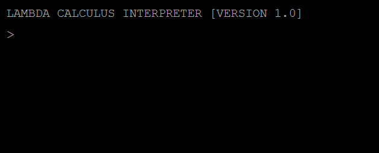
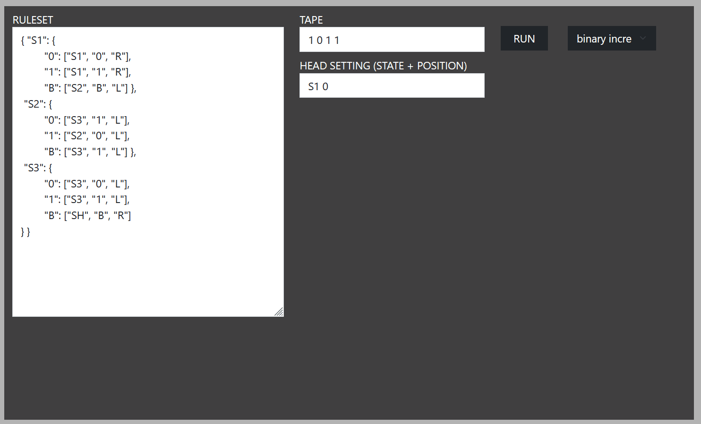

Website: https://n-alex-goncalves.github.io/Turing-Machine-Lambda-Calculus-Intepreter/

This is a web application that provides an interpreter for simulating and translating between the lambda calculus system and Turing machines. The application can translate in both directions, converting from the weak lambda calculus to the multi-tape Turing machine, or from the single-tape Turing machine to the weak lambda calculus. 

The methods used for these translations are based on those outlined by Dal Lago and Martini in their paper ["The Weak Lambda Calculus as a Reasonable Machine"](https://dl.acm.org/doi/10.1016/j.tcs.2008.01.044).

- Built in **HTML/CSS/JavaScript**
- User Interface built with **Bootstrap**, **JQuery**, **JQuery Terminal** and **FullPages**
- Tested using **Jest** and **Node.JS**

## Instructions for Simulating Turing Machine (TM) In the Lambda Calculus

1. In the `Single-Tape TM Interpreter`, run a TM using either an example in the drop-down list or create a TM of your own
2. In the `Lambda Calculus Interpreter`, enter 'T' to denote the beginning of the TM as a lambda term
3. In the `Lambda Calculus Interpreter`, enter to the right of 'T' the tape you want to run (e.g., T1011 to run the tape 1011)
4. Run the `Lambda Calculus Interpreter`

## Instructions for Simulating Lambda Calculus in the Multi-Tape Turing Machine (TM)

1. In the `Lambda Calculus Interpreter`, enter the lambda calculus term being converted
2. In the `Multi-Tape TM Interpreter`, the lambda calculus term entered in the `Lambda Calculus Interpreter`should now be converted into its Dal Lago and Martini notation
3. Run the `Multi-Tape TM Interpreter`
4. The tape of the interpreter at the halting state will be the weak head normal form of the lambda calculus term in Dal Lago and Martini notation

## Interpreter Showcase

### Lambda Calculus Interpreter

 
### Turing Machine (TM) Interpreter

## Files

- `lambda_calculus_interpreter.js`: The lambda calculus system and the interpreter for running and reducing the lambda calculus terms
- `single_tape_TM_interpreter.js`: The TM and its interpreter for running the TM
- `multi_tape_TM_interpreter.js`: The multi-tape interpreter used to simulatie the lambda calculus in the multi-tape TM interpreter
- `simulation_TM_to_lambda_calculus.js`: The functions necessary to convert the single-tape TM into a lambda calculus term 

## Dependencies & References

Thanks go to the following authors/resources for their help and guidance:

[jQuery](https://jquery.com/)  
[jQuery Terminal](https://terminal.jcubic.pl/)  
[BootStrap](https://getbootstrap.com/)  
[fullPage.js](https://alvarotrigo.com/fullPage/)  
[Chad Palmer](https://medium.com/swlh/a-complete-web-page-building-a-turing-machine-in-javascript-d6c32d3708c4)  
[Tadeu Zagallo](https://tadeuzagallo.com/blog/writing-a-lambda-calculus-interpreter-in-javascript/)  
